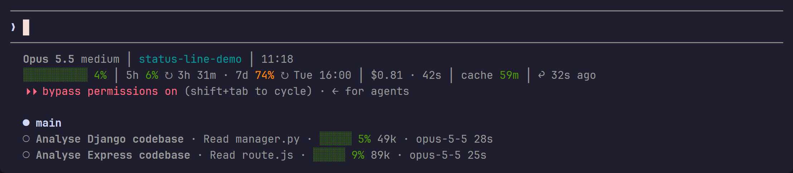

<div align="center">

# claude-status-line

A two-line status line for [Claude Code](https://code.claude.com), with a row for each running subagent.

[](https://github.com/zachlagden/claude-status-line/stargazers)
[](https://github.com/zachlagden/claude-status-line/commits/main)
[](https://nodejs.org)
[](#install)



</div>

## What it shows

### Main status line

When the terminal is too narrow, each line drops its lowest-priority segments first.

| Line | Segments |
|---|---|
| Top | Model, effort and fast mode, project folder (linked to its repo), git branch with dirty, ahead and behind markers, pull request and review state, worktree, agent name, clock |
| Bottom | Context bar measured against the auto-compact threshold, 5-hour, 7-day and spend limits with reset times, session cost and duration, prompt cache time left, lines added and removed, time since your last prompt |

### Subagent rows

One row per subagent: its name, the tool call it's running now, a context bar with its token count, and its model, effort and elapsed time.

> [!WARNING]
> The subagent rows misbehave with [Agent Teams](https://code.claude.com/docs/en/agent-teams) turned on (`CLAUDE_CODE_EXPERIMENTAL_AGENT_TEAMS=1`).

## Install

Clone into `~/.claude/statusline`:

```sh
git clone https://github.com/zachlagden/claude-status-line ~/.claude/statusline
```

Add this to `~/.claude/settings.json`:

```json
{
  "statusLine": {
    "type": "command",
    "command": "node \"${HOME}/.claude/statusline/statusline.js\"",
    "refreshInterval": 5
  },
  "subagentStatusLine": {
    "type": "command",
    "command": "node \"${HOME}/.claude/statusline/subagent-statusline.js\""
  }
}
```

It needs Node.js 18 or later, with `git` on the `PATH`.

## Caching

Git status is cached for 5 seconds in a file under the system temp directory, so a refresh every 5 seconds runs `git status` at most once per folder.
